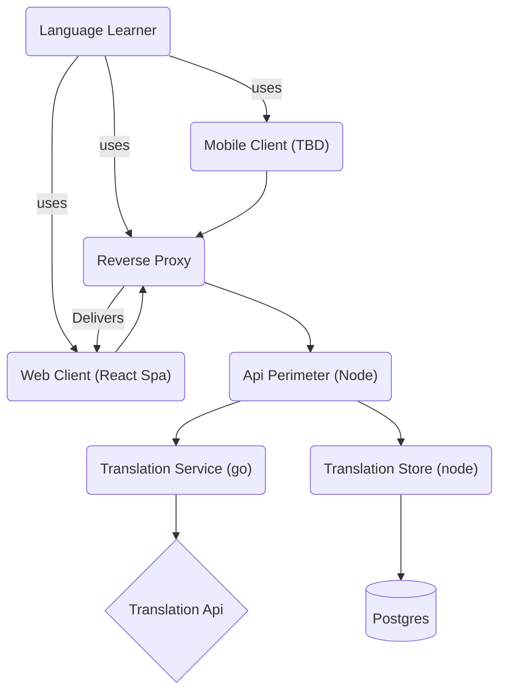

## Goal
- Create a vocabulary app where a user can store words they are studying for their target language. 
- The app supports grouping words by tags created by the user that can indicate an activity, scenario, or country dialect
	- Examples: "pharmacy", "doing laundry", "nightlife", "mexico", "colombia".
- The app supports fetching translations of words from a translation API
- The app allows the user to set their own translations. 
- The app allows multiple translations
## Overview

### Diagram

### Frontend
#### Web Client
- Serves a UI for interacting with the language app.
- Single Page App - React
- Features:
	- Enter words with user provided translation
	- Search for translations
	- Set tags for words in order to group them
	- View entered words by tag
#### Mobile Client
 - TBD
 - Native iOS? React Native? Flutter?
### Backend
#### Vocab API
- Domain: `zwsmith.me/api/`
- Typescript/Node app using Express
- Store words and their translations
- Keeps track of tags set by users and their associated word
- Data:
```sql
CREATE TABLE Word (
    word_id SERIAL PRIMARY KEY,
    word_text VARCHAR(100) NOT NULL,
    language_id INT REFERENCES Languages(language_id),
);

CREATE TABLE Language (
    language_id SERIAL PRIMARY KEY,
    language_code VARCHAR(3) NOT NULL
);

CREATE TABLE Translation (
    translation_id SERIAL PRIMARY KEY,
	first_word_id INT REFERENCES Word(word_id),
	second_word_id INT REFERENCES Word(word_id)
)

CREATE TABLE Tag (
    tag_id SERIAL PRIMARY KEY,
    tag_text VARCHAR(500)
)

CREATE TABLE Word_Tag (
    word_id INT REFERENCES Word(word_id),
    tag_id INT REFERENCES Tag(tag_id)
)
```
#### Translation service:
	- Go
	- Talks to [DeepL API](https://www.deepl.com/docs-api) for fetching translations
